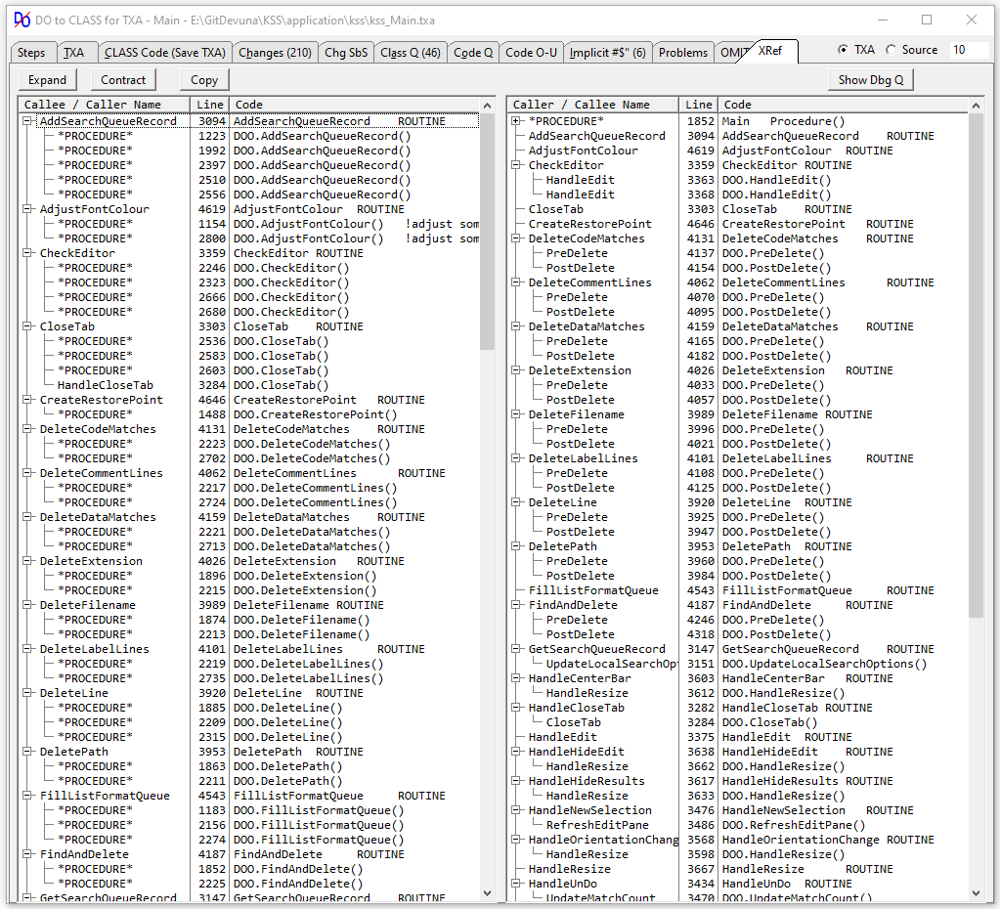

# Carl Barnes Fork Changes to Devuna-KwikSourceSearch #

I created this fork to show the changes made by my [Do2Class Utility](https://github.com/CarlTBarnes/Do2Class) to convert from ROUTINE code to a Local CLASS. The only fixes needed after conversion were for duplicate symbols, the compiler ignores duplicates for local routines but not for local class code. 

One benefit is the Class Declaration acts as a sort of Table of Contents to local routines which can make it easier to understand and a place to record comments about the purpose of each routine which will appear in the intellisense. With 46 routines in the Main search procedure there is a good amount of this code. Do2Class also has an XREF tab showing both Callee/Caller and Caller/Callee to help understand the code (see below).

To see the changes made look in the [Application KSS folder](https://github.com/CarlTBarnes/Devuna-KwikSourceSearch/tree/master/application/kss) repo folder at the CLW files and their change history commits tagged as "Do2Class". The number of changed lines will usually require clicking on **"Load Diff - Large diffs are not rendered by default"** to view the details.

Below is a list of the most interesting files. Open the link and search for DOO, then look at History:

| Module File | Procedure Name | Count | Link - Click on History for Changes|
|---|---|---|---|
| Kss001.CLW | Main            | 46 Routines | [Kss001.CLW](https://github.com/CarlTBarnes/Devuna-KwikSourceSearch/blob/master/application/kss/kss001.clw) |
| Kss020.CLW | PropertyEditor  | 18 Routines | [Kss020.CLW](https://github.com/CarlTBarnes/Devuna-KwikSourceSearch/blob/master/application/kss/kss020.clw) |
| Kss004.CLW | FillResultQueue | 9 Routines  | [Kss004.CLW](https://github.com/CarlTBarnes/Devuna-KwikSourceSearch/blob/master/application/kss/kss004.clw) |
| Kss006.CLW | UserOptions     | 6 Routines  | [Kss006.CLW](https://github.com/CarlTBarnes/Devuna-KwikSourceSearch/blob/master/application/kss/kss006.clw) |

For the Main procedure with 46 routines there were 210 lines changes noted. There were 46 simply to change `ROUTINE` to `PROCEDURE`. The other 164 would be mostly to change `DO RoutineName` to `DOO.RoutineName()`. There were about 10-15 changes of `EXIT` to `RETURN`, and to remove `DATA`. Not counted was in data adding `DOO CLASS` with 46 `RoutineName PROCEDURE()` lines  and `END`, plus a `CODE` line was added to all 46 routines. Very simple changes but tedious to make about 300 by hand.

## Do2Class Cross Reference ##

Screen capture of the Do2Clss XREF of the Main procedure with 46 routines. When the DO Routine occurs in the Procedure it appears as \*PROCEDURE\* in the Tree. In the right-side Caller/Callee list the \*PROCEDURE\* has been contracted because it is two pages long. You can double click (or right click) on these lines and view the complete source code surrounding the call to aid in understanding. 

---
... below is the original readme ...
---
# Devuna-KwikSourceSearch #

**February 18, 2019 Release**
This release includes bug fixes and many enhancements suggested by Mark Riffy's fork of this project.  

***Release Notes***

1) Added 'Include Files with Non-printable Characters' to the search parameters window.  When checked the /p flag is removed from the findstr command line.
   
2) The 'Read File List from Specified File' now supports selecting an application filelist.xml file.     This causes KSS to process all clw, inc, def, equ, trn and int files listed in the xml file
   
3) Added code to force the main window onto the primary monitor on startup when only one monitor is available.  This resolves the issue of non-accessible windows in certain situations when multiple monitors are involved.

4) Fixed bug in exclude MATCH code, to achieve the same effect as Mark Riffy's additional toolbar button that deletes generated built-in Clarion files.  Simply place this (without quotes) in the Exclude field '*_BC*.clw;*_SF.clw;*_R*.clw' to have them excluded from the results.

5) Added Copy for Skype and Copy for Slack to editor context menu

6) CheckRegistration procedure uses GetUserName() for unregistered public domain versions of the program.

7) Compiled and tested with Clarion 11.0.13244

**August 2017 Initial Public Release**

With Kwik Source Search (KSS) you can perform powerful standard and regular expression searches through one or multiple text files, such as source code, log files, and debugging information.

KSS is capable of finding the exact text you are looking for in any ASCII file or files. Sometimes you have only part of the information that you want to match, or you want to find a wider range of information. In such cases, KSS has the powerful capability to search for patterns of text using regular expressions.

The underlying search engine for KSS is the Findstr command. KSS provides a convenient, user friendly, interface for the many command line options. Files with non-printable characters are always skipped and the regular expression functionality of the Findstr command is used for the main text search.

KSS captures and filters the output of the Findstr command, opens the file associated with the selected result list item, and displays it in a syntax highlighting editor. KSS has built-in styling for Clarion, C++, C#, HTML, Java, and XML source files and can easily be extended, through the use of special property files, to provide styling for other languages.

This version of KSS is slightly different from the last commercial release.

Most notably the Results List 'Print' and the 'CheckForUpdate' features have been removed as they required other 3rd party tools, some of which are no longer available.

